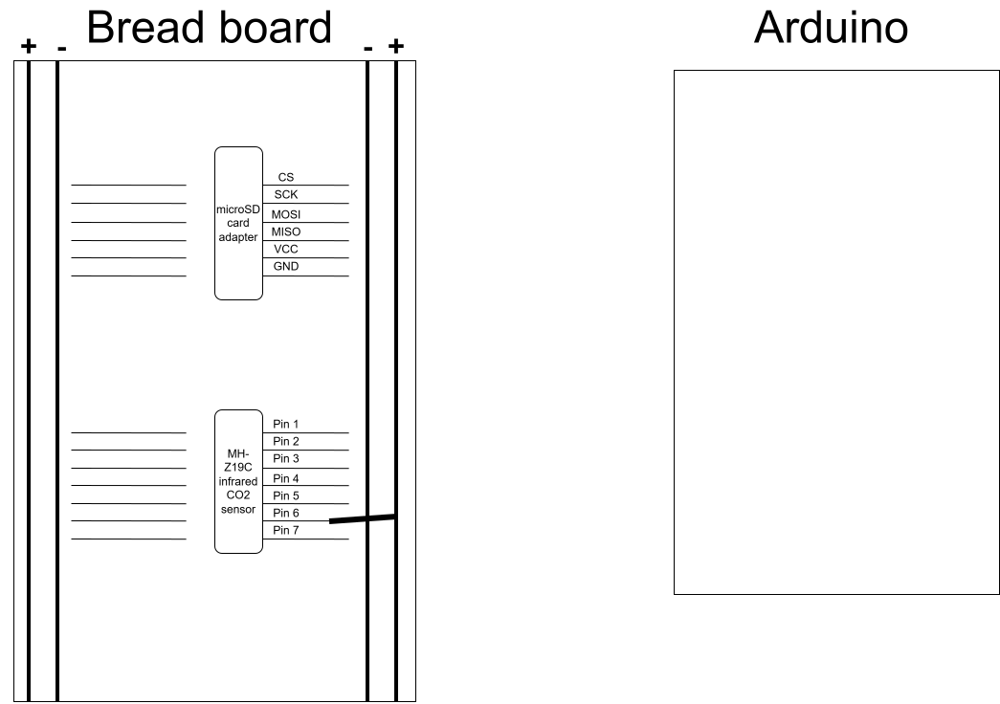

# Wiring

Photographs are not a wiring diagram. This file states every connection explicitly, because a photograph of a breadboard cannot be read reliably by someone who did not build it.

A pinout diagram of the Arduino Uno is useful alongside this page; the official
one is on `docs.arduino.cc` under "Arduino Uno Rev3".

---

## Setup A — CO₂ logger (MH-Z19 + SD card)

> **How to edit this diagram**
>
> The image is also the source file: `schematic.drawio.svg` contains a copy of the diagram, so it can be reopened and edited in draw.io. There is no separate `.drawio` file to keep in sync.
>
> 1. Pull the latest version first, and tell the group you are editing it. Two people editing at once overwrite each other, because git cannot merge images.
> 2. Open <https://app.diagrams.net> and choose **File → Open from → Device**, then select `schematic.drawio.svg`.
> 3. Edit, then **File → Save**. Check that the downloaded file is still called `schematic.drawio.svg`.
> 4. Replace the file in `hardware/` and commit. On GitHub: *Add file → Upload files* with the same name, commit straight to `main`.

### MH-Z19 CO₂ sensor

| Arduino pin | MH-Z19 pin | Why |
|---|---|---|
| Pin 6 | **TX** | Pin 6 is the Arduino's software-serial RX. RX always connects to the other device's TX |
| Pin 7 | **RX** | Pin 7 is the Arduino's software-serial TX |
| 5V | **Vin** |  |
| GND | **GND** | Must share a common ground with the Arduino and the SD reader |

### SD card reader

| Arduino pin | SD reader pin | Why |
|---|---|---|
| Pin 10 | **CS** (or `SS`) | Set in the sketch as `const int chipSelect = 10;` |
| Pin 11 | **MOSI** | Fixed by the hardware SPI peripheral on the Uno |
| Pin 12 | **MISO** | Fixed by the hardware SPI peripheral on the Uno |
| Pin 13 | **SCK** | Fixed by the hardware SPI peripheral on the Uno |
| 5V | **VCC** | _TODO: check your breakout — some are 3.3 V only_ |
| GND | **GND** | Common ground |

Pins 11, 12 and 13 never appear in the sketch. They do not need to: `SPI.h`
drives them directly, and on an Uno their locations are fixed in silicon. Only
`CS` is configurable, which is why only `chipSelect` is declared.

---

## Setup B — P/T/RH logger 

## Wiring checklist before powering up

- [ ] All grounds are common (sensor, SD reader and Arduino share GND)
- [ ] No component is connected to pins 0 or 1
- [ ] Supply voltage of each breakout matches what it tolerates

