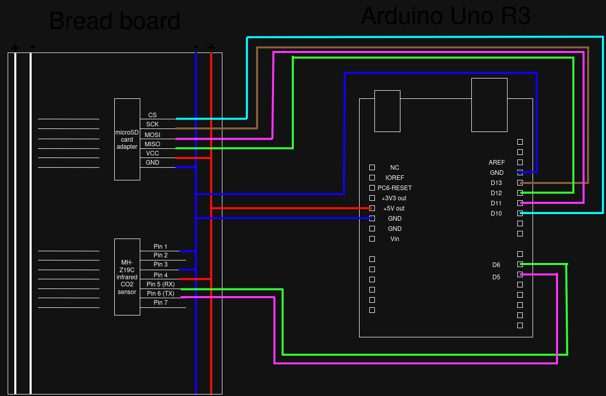

# Wiring

This file states every connection explicitly, because a photograph of a breadboard cannot be read reliably by someone who did not build it.

A pinout diagram of the Arduino Uno is useful alongside this page; the official
one is on `docs.arduino.cc` under "Arduino Uno Rev3".

---

## Setup A — CO₂ logger (MH-Z19 + SD card)

### MH-Z19 CO₂ sensor

| Arduino pin | MH-Z19 pin | Why |
|---|---|---|
| Pin 6 | **TX** | Pin 6 is the Arduino's software-serial RX. RX always connects to the other device's TX |
| Pin 7 | **RX** | Pin 7 is the Arduino's software-serial TX |
| 5V | **Vin** |  |
| GND | **GND** | Must share a common ground with the Arduino and the SD reader |

### SD card reader

| Arduino pin | SD reader pin | Why |
|---|---|---|
| Pin 10 | **CS** (or `SS`) | Set in the sketch as `const int chipSelect = 10;` |
| Pin 11 | **MOSI** | Fixed by the hardware SPI peripheral on the Uno |
| Pin 12 | **MISO** | Fixed by the hardware SPI peripheral on the Uno |
| Pin 13 | **SCK** | Fixed by the hardware SPI peripheral on the Uno |
| 5V | **VCC** | check your breakout, some are 3.3 V only (see wiring checklist below) |
| GND | **GND** | Common ground |

---

## Wiring checklist before powering up

- [ ] All grounds are common (sensor, SD reader and Arduino share GND)
- [ ] No component is connected to pins 0 or 1
- [ ] Supply voltage of each breakout matches what it tolerates

# Manuals
## Arduino

The manual for the arduino can be found here:
https://agelectronica.lat/pdfs/textos/A/A000066.PDF

## CO2 sensor

The manual for the CO2 sensor can be found here:
https://www.tinytronics.nl/product_files/003109_MH-Z19C-DZ-terminal%20type%20CO2%20Manual(Ver1.21)-202103.pdf

## The SD card manual is

The manual for the SD card reader can be found here:
https://docs.arduino.cc/learn/programming/sd-guide/
